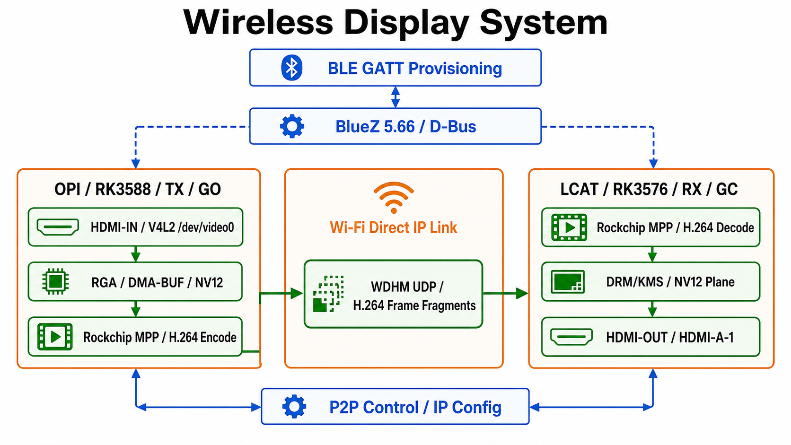

# Wireless Display

基于 Rockchip Linux 开发板的低延迟无线 HDMI 投屏实验项目。

项目采用 Wi-Fi Direct 建立设备间 IP 链路，使用 BLE GATT 完成设备配置，
在 OPI 发射端通过 V4L2/RGA/MPP 获取并编码 HDMI 输入，在 LCAT 接收端通过
MPP/DRM-KMS 解码并输出 HDMI。

当前版本：**0.1.6**（见 [VERSION](VERSION)）

## 功能概览

- Wi-Fi Direct GO/GC 建链与断线自动重连
- BlueZ D-Bus 自定义 GATT 配网服务
- Rockchip MPP H.264 硬件编码和解码
- RGA DMA-BUF 图像格式转换
- DRM/KMS Plane 直接输出 HDMI
- 自定义低延迟 UDP 帧分片协议（`WDHM`）

## 系统结构



## 验证硬件与运行时环境

以下信息对应当前已验证的实验环境；不同板卡镜像可能需要替换工具链、sysroot
或动态库版本。

| 设备 | SoC/架构 | 系统与内核 | 项目角色 | 关键设备 |
| --- | --- | --- | --- | --- |
| OPI | Rockchip RK3588 / aarch64 | Debian 12；`6.1.99-rockchip-rk3588` | TX / Wi-Fi Direct GO | `/dev/video0` HDMI-IN、`/dev/rga`、`/dev/mpp_service` |
| LCAT（野火 LubanCat） | Rockchip RK3576 / aarch64 | Debian 12；`6.1.99-rk3576` | RX / Wi-Fi Direct GC | `/dev/dri/card0`、`/dev/mpp_service`、HDMI-A-1 |
| PC 编译机 | x86_64 | Ubuntu 22.04.5 | 交叉编译与部署 | 对应板卡 SDK、sysroot 和 CMake 工具链 |

两块板使用 glibc 2.36、little-endian ARM64 用户态。已验证的无线驱动为
`rtw89_8852be`；OPI 默认无线接口为 `wlP2p33s0`，LCAT 默认无线接口为
`wlan0`。运行 P2P 前需要系统的 `wpa_supplicant`/`wpa_cli`、`nl80211` 驱动
和 BlueZ 5.66。

### 动态库与系统依赖

| 程序/功能 | 主要运行时依赖 | 说明 |
| --- | --- | --- |
| `p2p_manager` / `ble_provisioner` | `libdbus-1.so.3`、`libstdc++.so.6`、`libgcc_s.so.1`、glibc | BLE GATT 通过 system D-Bus 访问 BlueZ |
| `wd_tx` | `librockchip_mpp.so.0`、`librga.so.2`、`libstdc++.so.6`、glibc | OPI 上完成 V4L2 采集、RGA 转换和 MPP 编码 |
| `wd_rx` | `librockchip_mpp.so.0`、`libdrm.so.2`、`libstdc++.so.6`、glibc | LCAT 上完成 MPP 解码和 DRM/KMS 显示 |
| BLE 运行环境 | `bluetooth.service`、BlueZ 5.66、system D-Bus | 需要注册 GATT Application 和 LE Advertisement |
| Wi-Fi Direct 运行环境 | `wpa_supplicant`、`wpa_cli`、nl80211 | 应用通过 Unix control socket 控制 P2P |

编译阶段还需要对应 sysroot 中的 `rk_mpi.h`、`im2d.h`、`xf86drm.h`、DRM
内核头文件和 D-Bus 头文件。动态库版本应以目标板实际镜像为准，可使用：

```bash
ldd ./p2p_manager
ldd ./wd_tx
ldd ./wd_rx
```

### 静态依赖与动态依赖矩阵

| 目标 | 项目内部静态库 | 第三方静态/header-only 依赖 | 目标板动态库 |
| --- | --- | --- | --- |
| `p2p_manager` | `ble_core`、`p2p_core`、`p2p_app_utils` | `spdlog` 静态库、nlohmann/json header-only | `libdbus-1.so.3`、glibc、libstdc++、libgcc_s |
| `ble_provisioner` | `ble_core` | `spdlog` 静态库、nlohmann/json header-only | `libdbus-1.so.3`、glibc、libstdc++、libgcc_s |
| `wd_tx` | `video_transport` | 无额外项目库 | `librockchip_mpp.so.0`、`librga.so.2`、glibc、libstdc++ |
| `wd_rx` | `video_transport` | 无额外项目库 | `librockchip_mpp.so.0`、`libdrm.so.2`、glibc、libstdc++ |

项目 CMake 默认将 `spdlog` 构建为静态库；`nlohmann/json` 只提供头文件，
不会产生运行时动态库；`video_transport`、`p2p_core`、`ble_core` 和
`p2p_app_utils` 也都是项目内部静态库，最终链接进对应可执行文件。

此外，运行时还需要外部进程/服务：`wpa_supplicant`、`bluetoothd`、
`bluetooth.service` 和 system D-Bus。它们不是由本项目静态链接或打包的库。

## 目录

| 路径 | 内容 |
| --- | --- |
| `src/p2p_app` | BLE、P2P 和系统工具；包含 `p2p_manager`、`ble_provisioner` |
| `src/media` | UDP 传输、MPP 编码/解码和 DRM 显示；包含 `wd_tx`、`wd_rx` |
| `config` | GO/GC 示例配置 |
| `docs` | 协议、媒体链路和 BLE 配网说明 |
| `third_party` | nlohmann/json、spdlog、wpa_supplicant 相关依赖 |

公开仓库不包含实验环境部署脚本、Shell 脚本、构建目录和解压的 BlueZ 源码。

## 构建

### P2P/BLE 应用

```bash
cmake -S . -B build \
  -DCMAKE_TOOLCHAIN_FILE=/path/to/aarch64-toolchain.cmake \
  -DENABLE_DRM_TARGETS=OFF
cmake --build build -j$(nproc)
```

产物位于 `build/src/p2p_app/`。

### 媒体链路

媒体程序需要对应板卡的 Rockchip MPP、RGA、DRM 头文件和运行库。分别使用
OPI 和 LCAT 的交叉工具链配置：

```bash
cmake -S . -B build-opi \
  -DCMAKE_TOOLCHAIN_FILE=/path/to/opi-toolchain.cmake \
  -DENABLE_DRM_TARGETS=OFF
cmake --build build-opi --target wd_tx -j$(nproc)

cmake -S . -B build-lcat \
  -DCMAKE_TOOLCHAIN_FILE=/path/to/lcat-toolchain.cmake \
  -DENABLE_DRM_TARGETS=ON
cmake --build build-lcat --target wd_rx -j$(nproc)
```

## 配置

- [GO 配置](config/go.json)
- [GC 配置](config/gc.json)
- [BLE 配网协议](docs/蓝牙配网协议.md)
- [媒体链路说明](docs/媒体链路使用说明.md)

开发板验证记录保留在本地实验资料中，不纳入公开仓库。

## 当前限制

- 当前媒体传输层是项目自定义 UDP 协议，不是标准 RTP。
- `p2p_manager` 负责 P2P 链路和静态地址配置；DHCP 由外部部署流程负责。
- BLE 配置写入后会持久化，运行中模块重载仍需由上层状态机完成。
- BLE 产品化部署前仍应启用配对/加密、设备验证码和授权校验。
- 当前主要面向 OPI/RK3588 与 LCAT/RK3576 实验环境。

## 版本管理

版本号集中维护在根目录 `VERSION`，CMake 配置阶段会读取该文件作为项目版本。
版本变更记录见 [CHANGELOG.md](CHANGELOG.md)。

## License

项目许可证尚未确定。公开发布前请根据项目归属补充合适的许可证文件。
